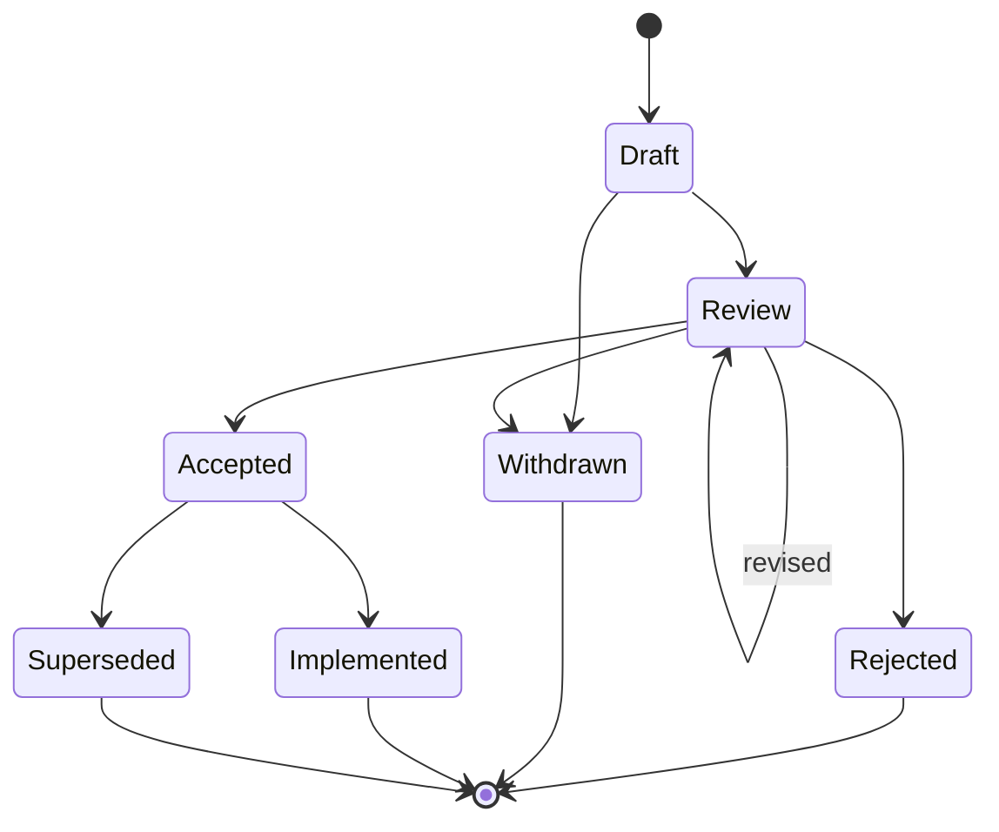
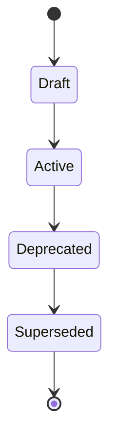

# Specification process

This section is informative.

This document describes the full lifecycle of a KIP (Knowledge Islands Proposal) and of a KIS (Knowledge Islands Specification) in detail, beyond the summary in [GOVERNANCE.md](../GOVERNANCE.md).

## The KIP lifecycle

A KIP is proposed by an Author as a directory under [../proposals/](../proposals/), following the file set described in [../CONTRIBUTING.md](../CONTRIBUTING.md).

1. **Proposed** — the Author opens a draft pull request with a placeholder number. A maintainer assigns the sequential `KIP-NNNNNN` number at this point, per [numbering.md](numbering.md), and the KIP enters `Draft`.
2. **Reviewed** — once the file set is complete, the KIP moves to `Review`. Reviewers assess scope, consistency with existing KIS documents, and whether alternatives are fairly represented, recording feedback against `status.md`.
3. **Revised** — the Author (or Editor) updates `proposal.md`, `rationale.md` or `alternatives.md` in response to review feedback. A KIP may cycle between `Review` and further revision as many times as needed.
4. **Accepted** — a maintainer decides the KIP should proceed. `status.md` records the decision and date. The KIP is now the mandate to draft a KIS.
5. **Rejected** — a maintainer decides the KIP should not proceed. The KIP directory remains in the repository as a permanent record; its number is never reused.
6. **Withdrawn** — the Author chooses not to proceed, at any point before acceptance. Also permanent, and also never renumbered.
7. **Implemented** — set once the KIS the KIP mandated has been drafted, numbered, and published at status `Draft` (see below). The KIP itself does not change further at this point beyond this marker.
8. **Superseded** — an `Accepted` KIP whose intent is entirely replaced by a later KIP, before or instead of being implemented.

```text
Draft -> Review -> Accepted -> Implemented -> Superseded
                 -> Rejected
Draft -> Withdrawn
Review -> Withdrawn
```

## From Accepted KIP to KIS

Once a KIP is `Accepted`, it is drafted into a KIS:

1. A maintainer assigns the next sequential `KIS-NNNN` number, per [numbering.md](numbering.md), and a directory `KIS-NNNN-<slug>` is created under [../specifications/](../specifications/).
2. The KIS is drafted using the accepted KIP's proposal and rationale as its basis, following the file set established by [../specifications/KIS-0001-knowledge-package/](../specifications/KIS-0001-knowledge-package/).
3. The KIS is published at status `Draft`, version `1.0.0` (or the first minor version appropriate to its scope), per [versioning.md](versioning.md).
4. Implementers build against the Draft KIS. Once there is real implementation experience — working packages, schemas, or tooling built against it, with no unresolved structural problems found — a maintainer promotes the KIS to `Active`, and marks the originating KIP `Implemented`.
5. An `Active` KIS may later be marked `Deprecated`, signalling it should not be used for new work though existing conformant packages remain valid, typically because a successor KIS is intended or already drafted.
6. A `Deprecated` KIS is marked `Superseded` once its successor KIS reaches `Active`, with a pointer to the successor.

```text
Draft -> Active -> Deprecated -> Superseded
```

## KIS versioning over time

A KIS document version follows semantic versioning, recorded in its status block (see [../specifications/KIS-0001-knowledge-package/README.md](../specifications/KIS-0001-knowledge-package/README.md) for the current example):

- **Patch** — editorial changes: clarifications, corrections, typo fixes, that do not change what a conformant implementation does.
- **Minor** — compatible additions: new optional fields, new informative guidance, new conformance-level detail, that do not invalidate existing conformant packages.
- **Major** — breaking changes: anything that would make a previously conformant package or implementation non-conformant. A major version always originates in a new KIP, reviewed and accepted as such, because it changes the normative contract.

Full detail on how this axis relates to schema `$id` versions and package versions is in [versioning.md](versioning.md).

## Status-flow diagrams

KIP:



KIS:


